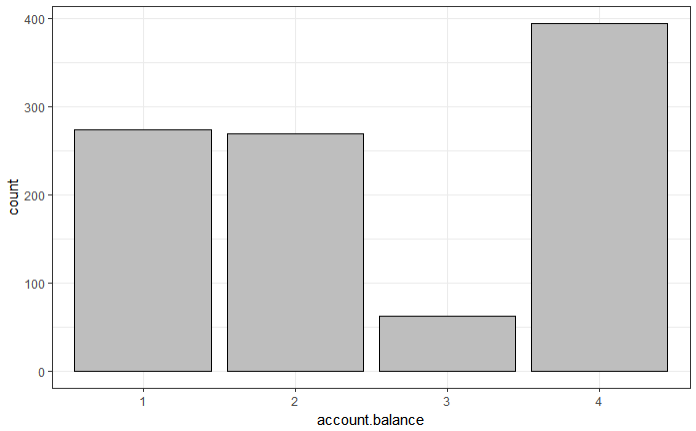

```{r setup, include=FALSE}
knitr::opts_chunk$set(echo = TRUE)
```

# Credit Rating

This project will assess data about the credit risk of certain customers of a German bank. In this dataset, the customers are classified as being a credit risk or not based on previously collected data.

Credit risk can be defined as defaulting on a debt, due to the borrower being unable to make the stipulated debt payments in the agreed upon time frame. It is useful for a bank to conduct risk analysis, in order to ascertain whether or not a specific customer is likely to defaul on his debt.

This part of the risk analysis will conduct decriptive analysis on the data set in order to determine which features are important and whether or not they display a relationship with credit risk. The subsequent step of the project will build predictive models using various machine learning techniques in order to build valuable predictive models for the bank to predict customer credit risk based on specific customer traits.

# The Data

The data is loaded in, dependencies are imported, column titles are adjusted and the data is investigated at a glance. Finally, the data is checked for NAs.

```{r LoadData}
# Dependencies
library(gridExtra)
library(pastecs)
library(ggplot2)
library(gmodels)
library(car)

# Import dataset as dataframe and clean the column headers
credit.df <- read.csv("german_credit.csv", header = TRUE, sep = ",")

colnames(credit.df) <- c("credit.rating", "account.balance", "credit.duration.months", "previous.credit.payment.status", "credit.purpose", "credit.amount", "savings", "employment.duration", "installment.rate", "marital.status", "guarantor", "residence.duration", "current.assets", "age", "other.credits", "apartment.type", "bank.credits", "occupation", "dependents", "telephone", "foreign.worker")

# Dataset information
head(credit.df, n = 3)
tail(credit.df, n = 3)

str(credit.df)

# No NAs, complete data
sum(is.na(credit.df)) > 0
sum(complete.cases(credit.df))
nrow(credit.df) == sum(complete.cases(credit.df))
```

# Functions

Functions are written to transform categorical variables to factors, generate summary statistics and generate visualisation. All dependent on the type of data used.

```{r Functions}
# Transform data
to.factors <- function(df, variables) {
  for (variable in variables) {
    df[[variable]] <- as.factor(df[[variable]])
  }
  return(df)
}

factor.vars <- c("credit.rating", "account.balance", "previous.credit.payment.status", "credit.purpose", "savings", "employment.duration", "installment.rate", "marital.status", "guarantor", "residence.duration", "current.assets", "other.credits", "apartment.type", "bank.credits", "occupation", "dependents", "telephone", "foreign.worker")

credit.df <- to.factors(df = credit.df, variables = factor.vars)

# Summary statistics: numerical
get.numeric.variable.stats <- function(indep.var, detailed = FALSE) {
  
  options(scipen = 100)
  options(digits = 2)
  
  if (detailed) {
    var.stats <- stat.desc(indep.var)
  } else {
    var.stats <- summary(indep.var)
  }
  
  df <- data.frame(round(as.numeric(var.stats), 2))
  colnames(df) <- deparse(substitute(indep.var))
  rownames(df) <- names(var.stats)
  
  if (names(dev.cur()) != "null device") {
    dev.off()
  }
  
  grid.table(t(df))
}

# Summary statistics: categorical
get.categorical.variable.stats <- function(indep.var) {
  
  feature.name <- deparse(substitute(indep.var))
  df1 <- data.frame(table(indep.var))
  colnames(df1) <- c (feature.name, "Frequency")
  
  df2 <- data.frame(prop.table(table(indep.var)))
  colnames(df2) <- c(feature.name, "Proportion")
  
  df <- merge(df1, df2, by = feature.name)
  
  ndf <- df[order(-df$Frequency), ]
  
  if (names(dev.cur()) != "null device") {
    dev.off()
  }
  
  grid.table(ndf)
}

# Generate contingency table
get.contingency.table <- function(dep.var, indep.var, stat.tests = F) {
  
  if (stat.tests == F) {
    CrossTable(dep.var, indep.var, digits = 1, prop.r = F, prop.t = F, prop.chisq = F)
  } else {
    CrossTable(dep.var, indep.var, digits = 1, prop.r = F, prop.t = F, prop.chisq = F, chisq = T, fisher = T)
  }
}

# Visualisation
## Histograms and density plots
visualize.distribution <- function(indep.var) {
  
  pl1 <- qplot(indep.var, geom = "histogram", fill = I("gray"), binwidth = 5, col = I("black")) + theme_bw()
  
  pl2 <- qplot(indep.var, geom = "density", fill = I("gray"), binwidth = 5, col = I("black")) + theme_bw()
  
  grid.arrange(pl1, pl2, ncol = 2)
}

## Box plots
visualize.boxplot <- function(indep.var, dep.var) {
  
  pl1 <- qplot(factor(0), indep.var, geom = "boxplot", xlab = deparse(substitute(indep.var)), ylab = "Values") + theme_bw()
  
  pl2 <- qplot(dep.var, indep.var, geom = "boxplot", xlab = deparse(substitute(dep.var)), ylab = deparse(substitute(indep.var))) + theme_bw()
  
  grid.arrange(pl1, pl2, ncol = 2)
}

## Bar charts
visualize.barchart <- function(indep.var) {
  
  qplot(indep.var, geom = "bar", fill = I("gray"), col = I("black"), xlab = deparse(substitute(indep.var))) + theme_bw()
}

## Mosaic plots
visualize.contingency.table <- function(dep.var, indep.var) {
  
  if(names(dev.cur()) != "null device") {
    dev.off()
  }
  
  mosaicplot(dep.var ~ indep.var, color = T, main = "Contingency Table Plot")
}

```

```{r Attach}
# Attach data to enable direct calls
attach(credit.df)
```

# Descriptive Analysis

The actual descriptive analysis will start from here and will build on all previously declared principles.

## Credit Rating

```{r CreditRating, echo=TRUE}
# Credit rating
get.categorical.variable.stats(credit.rating)
visualize.barchart(credit.rating)
```


## Account Balance

```{r AccountBalance}
# Account balance
get.categorical.variable.stats(account.balance)
visualize.barchart(account.balance)

## Combine class 3 and 4: new class indicaties positive balance in account
new.account.balance <- recode(account.balance, "1=1;2=2;3=3;4=3")
credit.df$account.balance <- new.account.balance

# Relationship: credit rating ~ new account balance and visualisation
get.contingency.table(credit.rating, new.account.balance, stat.tests = T)
visualize.contingency.table(credit.rating, new.account.balance)
```





## Credit Duration

```{r CreditDuration}
# Credit duration months
## Summary
get.numeric.variable.stats(credit.duration.months)

## Histogram and density plots
visualize.distribution(credit.duration.months)

# Credit duration months ~ credit rating
## Box plots
visualize.boxplot(credit.duration.months, credit.rating)
```


## Previous Credit Payment Status

```{r PrevCredPayStat}
# Previous credit payment status
get.categorical.variable.stats(previous.credit.payment.status)
visualize.barchart(previous.credit.payment.status)

# Combine semantics: 0 + 1 and 3 + 4
new.previous.credit.payment.status <- recode(previous.credit.payment.status, "0=1;1=1;2=2;3=3;4=3")
credit.df$previous.credit.payment.status <- new.previous.credit.payment.status

# Contingency table tranformed semantics: credit rating ~ updated previous credit payment status
get.contingency.table(credit.rating, new.previous.credit.payment.status)
```


## Credit Purpose

```{r CreditPurpose}
# Credit purpose: statistics and visualisation
get.categorical.variable.stats(credit.purpose)
visualize.barchart(credit.purpose)

# Feature engineering on semantics: 1 = new car, 2 = used car, 3 = furniture items, 4 = others {containing all other previous semantics}
new.credit.purpose <- recode(credit.purpose, "0=4;1=1;2=2;3=3;4=3;5=3;6=3;7=4;8=4;9=4;10=4")
credit.df$credit.purpose <- new.credit.purpose

# Contingency table: credit rating ~ updated credit purpose
get.contingency.table(credit.rating, new.credit.purpose, stat.tests = TRUE)
```


## Credit Amount

```{r CreditAmount}
# Credit amount: statistics and visualisation
get.numeric.variable.stats(credit.amount)
visualize.distribution(credit.amount)

# Relationship: credit amount ~ credit rating
visualize.boxplot(credit.amount, credit.rating)
```


## Savings

```{r Savings}
# Savings: recode semantics
new.savings <- recode(savings, "1=1;2=2;3=3;4=3;5=4")
credit.df$savings <- new.savings

# Contingency table: credit rating ~ savings
get.contingency.table(credit.rating, savings, stat.tests = FALSE)
```

## Employment Duration & Installment Rate

```{r EmpDurInstRate}
# Employment duration: recode semantics
new.employment.duration <- recode(employment.duration, "1=1;2=1;3=2;4=3;5=4")
credit.df$employment.duration <- new.employment.duration

# Contingency table: credit rating ~ updated employment duration
get.contingency.table(credit.rating, new.employment.duration, stat.tests = TRUE)

# Contingency table: credit rating ~ installment.rate
get.contingency.table(credit.rating, installment.rate, stat.tests = TRUE)
```

## Marital Status & Guarantor

```{r MarStatGuarantor}
# Marital status: recode semantics
new.marital.status <- recode(marital.status, "1=1;2=1;3=2;4=3")
credit.df$marital.status <- new.marital.status

# Contingency table: credit rating ~ updated marital status
get.contingency.table(credit.rating, new.marital.status, stat.tests = TRUE)

# Guarantor: recode semantics and relationship tests
new.guarantor <- recode(guarantor, "1=1;2=2;3=2")
credit.df$marital.status <- new.guarantor
get.contingency.table(credit.rating, new.guarantor, stat.tests = TRUE)
```

## Residence Duration & Current Assets

```{r ResDurCurrAssets}
# Relationship: credit rating ~ residence duration
fisher.test(credit.rating, residence.duration)
chisq.test(credit.rating, residence.duration)

# Relationship: credit rating ~ current assets
fisher.test(credit.rating, current.assets)
chisq.test(credit.rating, current.assets)
```

## Remaining features

This section includes visualisations for Age, recoding and testing the relationship of credit rating with Other Credits, Apartment Type, Bank Credits, Occupation, Dependents, Telephone and Foreign Worker.

```{r RemainingFeatures}
# Age: stats and visualisation
get.numeric.variable.stats(age)
visualize.distribution(age)
visualize.boxplot(age, credit.rating)

# Other credits: recode semantics and investigate relationship
new.other.credits <- recode(other.credits, "1=1;2=1;3=2")
credit.df$other.credits <- new.other.credits
fisher.test(credit.rating, new.other.credits)
chisq.test(credit.rating, new.other.credits)

# Apartment type: relationship
fisher.test(credit.rating, apartment.type)
chisq.test(credit.rating, apartment.type)

# Bank credits: recode semantics and test relationship
new.bank.credits <- recode(bank.credits, "1=1;2=2;3=2;4=2")
credit.df$bank.credits <- new.bank.credits
fisher.test(credit.rating, new.bank.credits)
chisq.test(credit.rating, new.bank.credits)

# Occupation: relationships
fisher.test(credit.rating, occupation)
chisq.test(credit.rating, occupation)

# Relationships for: Dependents, Telephone and Foreign Worker
fisher.test(credit.rating, dependents)
chisq.test(credit.rating, dependents)

fisher.test(credit.rating, telephone)
chisq.test(credit.rating, telephone)

fisher.test(credit.rating, foreign.worker)
chisq.test(credit.rating, foreign.worker)
```


# Export

Finally, all transformed data is merged into a new dataset and saved to disk.

```{r}
# Save the new, tranformed data set
write.csv(file = "credit_dataset_transformed.csv", x = credit.df, row.names = F)
```

